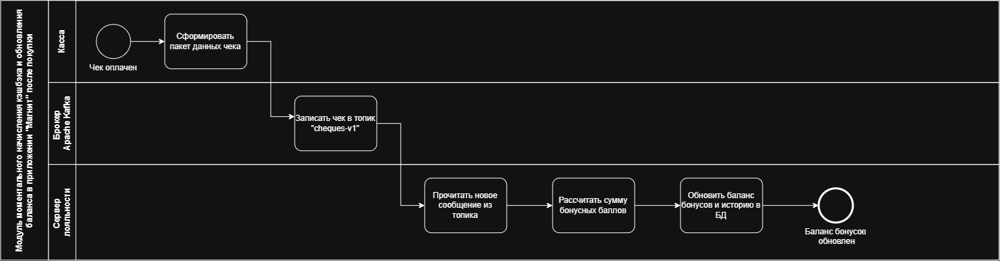
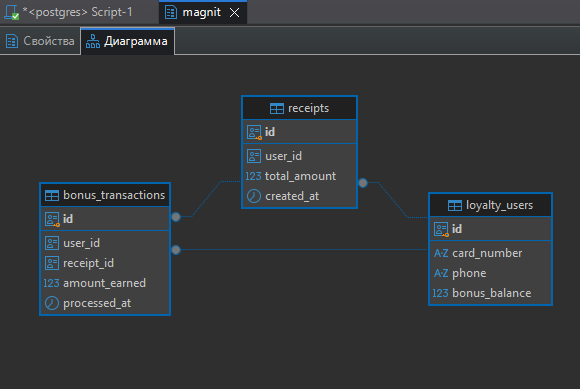
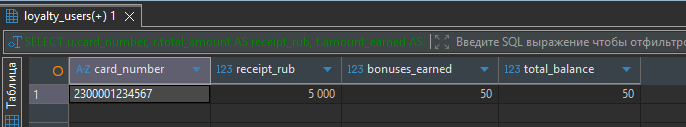

# Техническое задание: Модуль асинхронного начисления бонусов «Магнит Плюс»

## 1. Бизнес-процесс (BPMN)

Для исключения задержек на кассах самообслуживания (КСО) при пиковых нагрузках, процесс начисления бонусов лояльности спроектирован асинхронно через брокер сообщений Apache Kafka. Касса отправляет данные чека в шину данных и мгновенно закрывает операцию, а Сервер лояльности обрабатывает очередь в фоновом режиме.

> 
>  


---

## 2. Функциональные требования (User Story)

### US-2. Асинхронный расчет и начисление бонусов после покупки

- **Как:** Сервер системы лояльности
- **Я хочу:** автоматически вычитывать оплаченные чеки из очереди Apache Kafka и начислять кэшбэк на карту клиента
- **Чтобы:** покупатель моментально видел обновленный баланс бонусов в мобильном приложении «Магнит»

#### КРИТЕРИИ ПРИЕМКИ (ACCEPTANCE CRITERIA)

1. **Вычитывание данных:** Сервер лояльности должен работать в режиме постоянного слушателя (Consumer) топика `magnit.pos-orders.v1`.
2. **Логика расчета:** Сумма начисляемых бонусов составляет строго 1% от общей суммы чека (`total_amount`). Дробная часть округляется до двух знаков после запятой по математическим правилам.
3. **Запись истории:** По каждому обработанному чеку в базе данных должна создаваться детальная запись о транзакции начисления для исключения повторных начислений (дедупликация по `receipt_id`).
4. **Обновление баланса:** После успешной записи транзакции, итоговый баланс пользователя в таблице клиентов должен быть увеличен на рассчитанную сумму бонусов.

---

## 3. Интеграционные требования (Kafka контракт)

Передача данных с кассового терминала на сервер лояльности осуществляется через брокер сообщений **Apache Kafka**.

- **Название топика:** `magnit.pos-orders.v1`
- **Тип события:** `Order_Placed` (Чек успешно оплачен)

### Пример тела сообщения (Kafka Message Body):

```json
{
  "event_id": "e8888888-8888-8888-8888-888888888888",
  "event_timestamp": "2026-10-03T18:40:00Z",
  "pos_metadata": {
    "store_id": "MAGN-9941",
    "terminal_id": "KSO-04"
  },
  "order_data": {
    "receipt_id": "ade11111-1111-1111-1111-111111111111",
    "card_number": "2300001234567",
    "total_amount": 5000.00,
    "currency": "RUB"
  }
}
```

---

## 4. Архитектура данных (PostgreSQL)

Данные лояльности изолированы внутри СУБД PostgreSQL в отдельной схеме `magnit`. Модель данных состоит из трех связанных таблиц: Пользователи, Чеки и Транзакции бонусов.


> 
>  


### DDL-скрипт инициализации схемы базы данных:

```sql
-- Создаю таблицу пользователей
CREATE TABLE magnit.loyalty_users (
    id UUID PRIMARY KEY,                   
    card_number VARCHAR(30) UNIQUE NOT NULL, 
    phone VARCHAR(20) NOT NULL,            
    bonus_balance NUMERIC(10, 2) DEFAULT 0.00 
);

-- Создаю таблицу чеков
CREATE TABLE magnit.receipts (
    id UUID PRIMARY KEY,                   
    user_id UUID NOT NULL,                 
    total_amount NUMERIC(10, 2) NOT NULL,  
    created_at TIMESTAMP DEFAULT CURRENT_TIMESTAMP, 
    FOREIGN KEY (user_id) REFERENCES magnit.loyalty_users(id)
);

-- Создаю таблицу для истории бонусов
CREATE TABLE magnit.bonus_transactions (
    id UUID PRIMARY KEY,                   
    user_id UUID NOT NULL,                 
    receipt_id UUID NOT NULL,              
    amount_earned NUMERIC(10, 2) NOT NULL, 
    processed_at TIMESTAMP DEFAULT CURRENT_TIMESTAMP, 
    FOREIGN KEY (user_id) REFERENCES magnit.loyalty_users(id),
    FOREIGN KEY (receipt_id) REFERENCES magnit.receipts(id)
);
```

### SQL-скрипт:

```sql
-- Наполняю тестовыми данными (для примера - чек на 5000 рублей)
INSERT INTO magnit.loyalty_users (id, card_number, phone, bonus_balance)
VALUES ('c1111111-1111-1111-1111-111111111111', '2300001234567', '+79998887766', 0.00);

INSERT INTO magnit.receipts (id, user_id, total_amount)
VALUES ('ade11111-1111-1111-1111-111111111111', 'c1111111-1111-1111-1111-111111111111', 5000.00);

INSERT INTO magnit.bonus_transactions (id, user_id, receipt_id, amount_earned)
VALUES ('b2222222-2222-2222-2222-222222222222', 'c1111111-1111-1111-1111-111111111111', 'ade11111-1111-1111-1111-111111111111', 50.00);

UPDATE magnit.loyalty_users 
SET bonus_balance = bonus_balance + 50.00
WHERE id = 'c1111111-1111-1111-1111-111111111111';

-- Тестовый запрос
SELECT 
    u.card_number,
    r.total_amount AS receipt_rub,
    t.amount_earned AS bonuses_earned,
    u.bonus_balance AS total_balance
FROM magnit.loyalty_users u
JOIN magnit.receipts r ON r.user_id = u.id
JOIN magnit.bonus_transactions t ON t.receipt_id = r.id;
```


### Итоговая запись в БД:

 


### Перевод модуля лояльности на асинхронную событийную архитектуру (Event-Driven Architecture) позволяет достичь следующих показателей: 

1\.  Снижение времени блокировки кассового терминала при закрытии чека до < 50 миллисекунд (за счет мгновенной отправки сообщения в Apache Kafka). Касса не ждет ответа от базы данных и сразу готова обслуживать следующего покупателя. 

2\.  Пропускная способность кассовых зон в пиковые часы (распродажи, праздники) увеличивается на 25% за счет выноса тяжелых SQL-расчетов кэшбэка в фоновый режим. 

3\. Гарантированное начисление бонусов даже при временном падении сервера лояльности. Сообщения надежно хранятся в топике Kafka и будут обработаны сразу после восстановления работоспособности бэкенда.  
